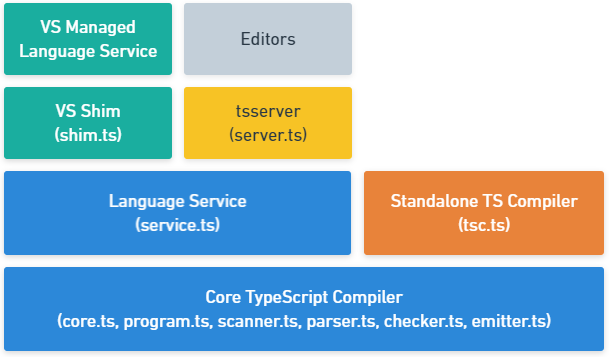

#  TypeScript Coding Guidelines

September 11, 2021

Editors:

- [Richard Zampieri](http)
- [Maybe you can help?]()

This is a living document under continuous improvement.
Copying, use, modification, and creation of derivative works from this project is licensed under an MIT-style license.
Contributing to this project requires agreeing to a Contributor License. See the accompanying [LICENSE](LICENSE) file for details.
We make this project available to "friendly users" to use, copy, modify, and derive from, hoping for constructive input.

Comments and suggestions for improvements are most welcome.
We plan to modify and extend this document as our understanding improves and the language and the set of available libraries improve.

You can [read an explanation of the scope and structure of this Guide](#S-abstract) or just jump straight in:

- [A: Architecture](#S-architecture)
- [C: Configuration](#S-configuration)
- [L: Language Features](#S-language-features)

# A: Architecture

## Layer Overview

| Core TypeScript Compiler     | Description                                                                                                                                                                                                                                                                                                                                                                                                                                                                                                                                                                                                                                                                                                                                                                                                                                       |
| ---------------------------- | ------------------------------------------------------------------------------------------------------------------------------------------------------------------------------------------------------------------------------------------------------------------------------------------------------------------------------------------------------------------------------------------------------------------------------------------------------------------------------------------------------------------------------------------------------------------------------------------------------------------------------------------------------------------------------------------------------------------------------------------------------------------------------------------------------------------------------------------------- |
| Parser                       | Starting from a set of sources, and following the productions of the language grammar, to generate an Abstract Syntax Tree (AST)                                                                                                                                                                                                                                                                                                                                                                                                                                                                                                                                                                                                                                                                                                                  |
| Binder                       | Linking declarations contributing to the same structure using a Symbol (e.g. different declarations of the same interface or module, or a function and a module with the same name). This allows the type system to reason about these named declarations.                                                                                                                                                                                                                                                                                                                                                                                                                                                                                                                                                                                        |
| Type resolver / Checker      | Resolving types of each construct, checking semantic operations and generate diagnostics as appropriate.                                                                                                                                                                                                                                                                                                                                                                                                                                                                                                                                                                                                                                                                                                                                          |
| Emitter                      | Output generated from a set of inputs (.ts and .d.ts) files can be one of: JavaScript (.js), definitions (.d.ts), or source maps (.js.map).                                                                                                                                                                                                                                                                                                                                                                                                                                                                                                                                                                                                                                                                                                       |
| Pre-processor                | The "Compilation Context" refers to all files involved in a "program". The context is created by inspecting all files passed in to the compiler on the command line, in order, and then adding any files they may reference directly or indirectly through import statements and /// <reference path=... /> tags. The result of walking the reference graph is an ordered list of source files, that constitute the program. When resolving imports, preference is given to ".ts" files over ".d.ts" files to ensure the most up-to-date files are processed. The compiler does a node-like process to resolve imports by walking up the directory chain to find a source file with a .ts or .d.ts extension matching the requested import. Failed import resolution does not result in an error, as an ambient module could be already declared. |
| Standalone Compiler (tsc)    | The batch compilation CLI. Mainly handle reading and writing files for different supported engines (e.g. Node.js).                                                                                                                                                                                                                                                                                                                                                                                                                                                                                                                                                                                                                                                                                                                                |
| Language Service             | The "Language Service" exposes an additional layer around the core compiler pipeline that are best suiting editor-like applications. The language service supports the common set of a typical editor operations like statement completions, signature help, code formatting and outlining, colorization, etc... Basic re-factoring like rename, Debugging interface helpers like validating breakpoints as well as TypeScript-specific features like support of incremental compilation (--watch equivalent on the command-line). The language service is designed to efficiently handle scenarios with files changing over time within a long-lived compilation context; in that sense, the language service provides a slightly different perspective about working with programs and source files from that of the other compiler interfaces. |
| Standalone Server (tsserver) | The `tsserver` wraps the compiler and services layer, and exposes them through a JSON protocol.                                                                                                                                                                                                                                                                                                                                                                                                                                                                                                                                                                                                                                                                                                                                                   |

[Please refer to Microsoft TypeScript Architecture Overview page for more details](https://github.com/microsoft/TypeScript/wiki/Architectural-Overview)
|
